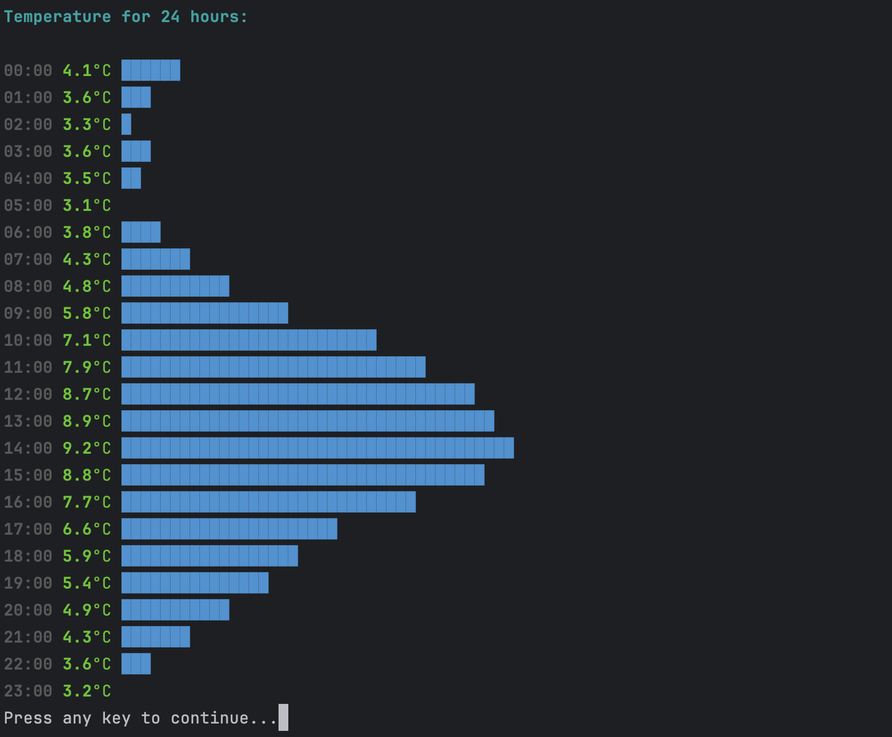
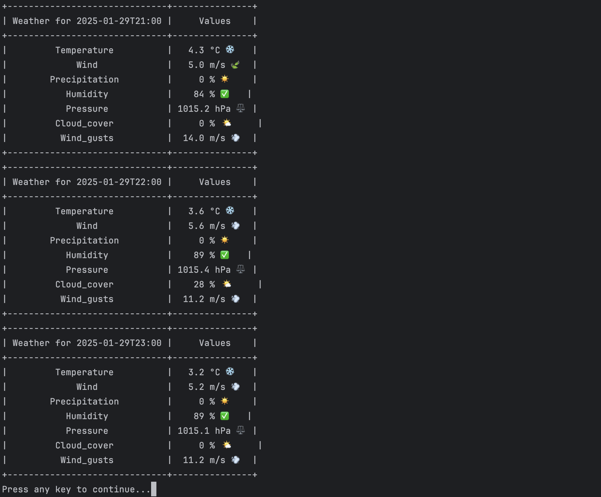
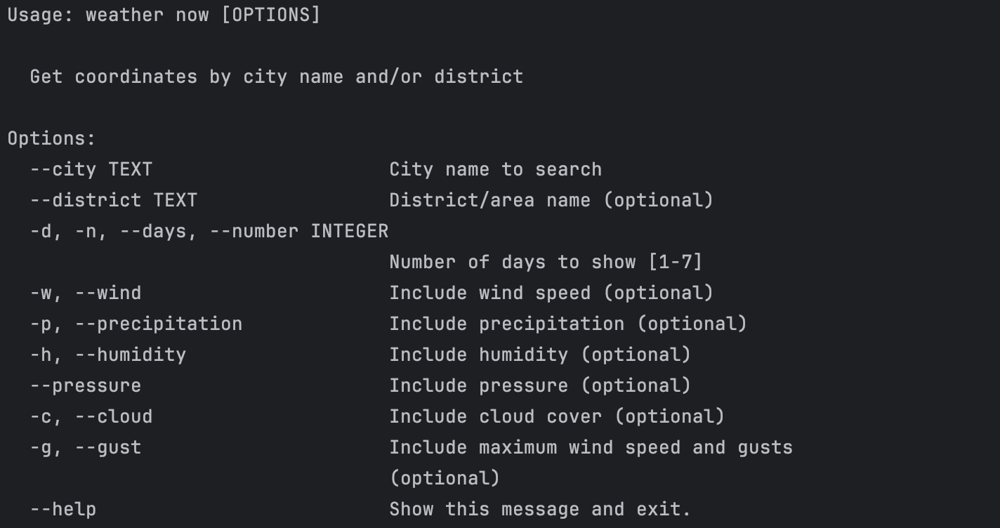

# WeatherCLI

A command-line tool that provides real-time weather information for any location worldwide. Uses Unix-style arguments for flexible customization of output data.




## Features

- **Geolocation search** by city name and optional district
- **Real-time weather data** with multiple parameters:
  - Temperature
  - Wind speed and gusts
  - Precipitation probability
  - Humidity
  - Atmospheric pressure
  - Cloud cover
- **Customizable forecast period** (1-7 days)
- **CLI options** following GNU/POSIX style guidelines

## Usage

Basic syntax:

```bash
weather now [OPTIONS]
```

### Examples

1. Basic city search:
```bash
weather now --city="Almaty"
```

2. Detailed location with district:
```bash
weather now --city="London" --district="Oxford Street"
```

3. 7-day forecast with wind data:
```bash
weather now --city="London" -d7 -w
```

4. Full weather report:
```bash
weather now --city="New York" -w -p -h --pressure --cloud -g
```

## All Options



## API Credits
This tool uses two free services:

1. OpenStreetMap Nominatim - For geolocation data
2. Open-Meteo - For weather forecast data (Provides complete meteorological dataset)

## Prerequisites

- Python 3.7+ installed
- Package manager of your choice:
  - These instructions demonstrate Homebrew for macOS/Linux
  - Windows users can use Chocolatey/Winget or direct Python installation
  - Linux users can use their native package manager (apt, yum, etc.)


## Installation Steps

1. **Clone the repository**
```bash
git clone https://github.com/ANovakk/WeatherCLI.git
cd WeatherCLI
```
2 **Install pipx (cross-platform Python application installer)**
```bash
brew install pipx
```

3. **Install the project**
```bash
pipx install . 
```

4. **Ensure pipx is added to PATH :**

Run the following command to add pipx binaries to your PATH:
```bash
pipx ensurepath
```

5. **Update your shell configuration :**

Depending on your shell, update your configuration file:

```bash
source ~/.zshrc
```

## Uninstallation Steps

```bash
pipx uninstall weather_cli
```